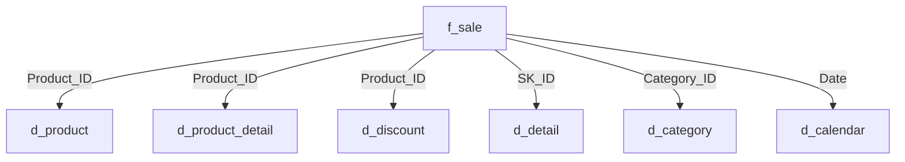

# Desafio de Projeto: Modelo Star Schema no Power BI

Este repositório contém a solução para o desafio de projeto de construção de um modelo baseado em star schema utilizando o Power BI. Abaixo, detalhamos o passo a passo do processo, as etapas do projeto, as funcionalidades e as funções DAX utilizadas.

## Objetivo do Desafio

Criar um modelo star schema a partir de uma tabela única chamada **Financial Sample**. O projeto envolve a criação de tabelas dimensão e fato com base na tabela original, utilizando recursos de modelagem e cálculos no Power BI.

## Estrutura do Projeto

O projeto consiste na criação das seguintes tabelas:

- **financials_source**: Tabela original utilizada como backup (modo oculto).
- **f_sale**: Tabela fato consolidando informações de vendas.
- **d_category**: Contém informações sobre categorias disponíveis.
- **d_product**: Contém informações sobre produtos e estatísticas de vendas.
- **d_product_detail**: Detalhes adicionais sobre produtos.
- **d_discount**: Informações sobre descontos aplicados.
- **d_detail**: Informações complementares não contempladas nas demais tabelas.
- **d_calendar**: Tabela de calendário criada com a função DAX `CALENDAR()`.

---

## Passo a Passo da Construção

### 1. Configuração Inicial

Importar a tabela **Financial Sample** para o Power BI, renomear para **financials_source** e definir como oculta, para evitar alterações diretas.

### 2. Criação das Tabelas Dimensão

#### a) **d_product**

1. Duplicar a tabela **financials_source** e renomear para **d_product**.
2. Selecionar a coluna:
   - `Product`
3. Criar as seguintes métricas utilizando DAX ou utilizando a opção "agrupar por":
   - **Média de Unidades Vendidas:** `AVERAGE(Units Sold)`
   - **Média do Valor de Vendas:** `AVERAGE(Sales)`
   - **Mediana do Valor de Vendas:** `MEDIAN(Sales)`
   - **Valor Máximo de Venda:** `MAX(Sales)`
   - **Valor Mínimo de Venda:** `MIN(Sales)`
4. Criar a coluna ID_product, usando a opção Adicionar Coluna -> Coluna de Índice.

#### b) Incluir Product_ID na tabela origem

Atualizar a tabela **financials_source**, criando a coluna Product_ID, usando a opção Adicionar Coluna -> Coluna Condicional, de acordo com a consulta do conteúdo dos campos Produto e Product_ID da tabela d_product.

#### c) **d_product_detail**

1. Duplicar a tabela **financials_source** e renomear para **d_product_detail**, e manter a coluna:
   - `Product_ID`
2. Criar as seguintes métricas utilizando DAX ou utilizando a opção "agrupar por":
   - **Soma de Unidades Vendidas:** `SUM(Units Sold)`
   - **Soma do Valor de Preço de Fabricação:** `SUM(Manufacturing_Price)`
   - **Soma do Valor de Vendas:** `SUM(Sale Price)`

#### d) **d_discount**

1. Duplicar a tabela **financials_source** e renomear para **d_discount**, e manter as colunas:
   - `Product_ID`
   - `Discount`
   - `Discount Band`

#### e) Incluir Category_ID na tabela origem

Atualizar a tabela **financials_source**, criando a coluna Category_ID com os 3 primeiros dígitos dos campos Segment e Country, usando Coluna Personalizada inserir a função DAX:
   - Category_ID = Text.Start([Segment],3) & Text.Start([Country],3)

#### f) **d_category**

1. Duplicar a tabela **financials_source** e renomear para **d_category**, e manter as colunas:
   - `Category_ID`
   - `Segment`
   - `Country`

#### g) **d_calendar**

Criar uma tabela de calendário com a função DAX:
```DAX
d_calendar = CALENDAR(MIN(financials_source[Date]), MAX(financials_source[Date]))
```
 
### 3. Criação da Tabela Fato (**f_sale**)

1. Incluir SK_ID na tabela origem

Atualizar a tabela **financials_source**, criando a coluna SK_ID, usando a opção Adicionar Coluna -> Coluna de Índice.

2. Duplicar a tabela **financials_source**, renomear para **f_sale**, e manter as colunas:
   - `SK_ID`
   - `Product_ID`
   - `Category_ID`
   - `Units Sold`
   - `Sales Price`
   - `Date`

### 4. Criação da Dimensão Detalhes da Tabela Fato

#### **d_detail**

Duplicar a tabela **financials_source**, renomear para **d_detail**, e manter as colunas:
   - `SK_ID`
   - `Gross Sales`
   - `Sales`
   - `COGS`
   - `Profit`

### 5. Modelagem do Diagrama

1. Reorganizar as tabelas no modelo de dados para formar o esquema estrela:
   - A tabela **f_sale** no centro.
   - As tabelas dimensão conectadas a ela via chaves estrangeiras.
2. Definir os relacionamentos apropriados entre as tabelas.

---

## Funções DAX Utilizadas

- `AVERAGE()`: Cálculo da média.
- `MEDIAN()`: Cálculo da mediana.
- `MAX()`, `MIN()`: Identificação dos valores máximo e mínimo.
- `SUM()`: Cálculo da soma.
- `CALENDAR()`: Criação da tabela de calendário.

---

## Modelo de Esquema Estrela

Diagrama do esquema estrela criado no Power BI:


## Salvar e Documentar o Projeto

Inclua neste repositório:
- Arquivo **.pbix**.
- Imagem do esquema em estrela.
- Este README.md detalhado.

Com isso, temos compartilhada a solução do desafio descrito.

---
