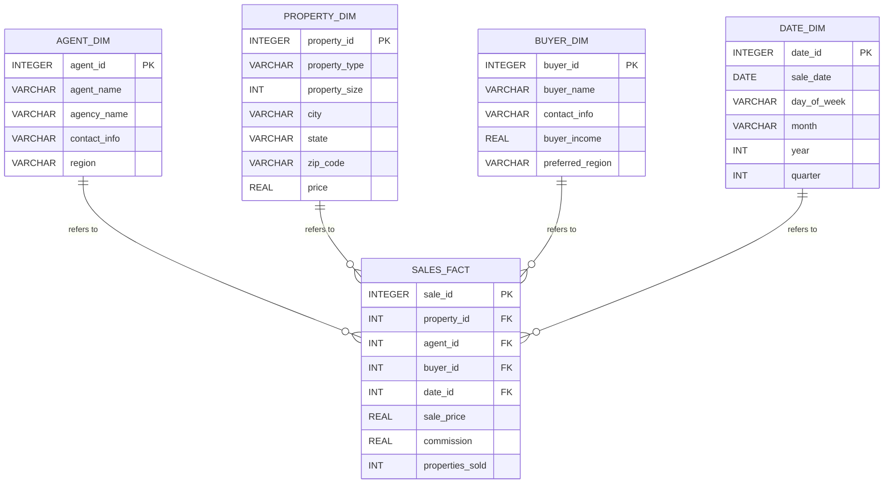

# Building a Star Schema for a Real Estate Business: Step-by-Step Guide

In a real estate business, data is crucial for analyzing sales, property listings, agents' performance, and market trends. A **star schema** is an ideal approach for structuring this data to allow for efficient querying and reporting. This guide will walk you through building a star schema specific to a real estate business, complete with explanations and SQL scripts.

## 1. **Understanding the Star Schema in Real Estate**

### What is a Star Schema?

A **star schema** is a type of database schema that centers around a **fact table** and is connected to multiple **dimension tables**. It is called a "star" because of its appearance, where the fact table sits at the center, with dimension tables radiating outward.

### Components of a Real Estate Star Schema:

- **Fact Table**: Stores transactional data like property sales, including numeric values such as sales price, commissions, and number of properties sold.
- **Dimension Tables**: These contain descriptive attributes related to the transactions, such as `Agent`, `Property`, `Buyer`, and `Date`.

For a real estate business, this schema will allow you to track which agents sold properties, the prices, locations, and the associated dates.

---

## 2. **Step-by-Step Design of the Real Estate Star Schema**

### 2.1. **Identify the Business Process**

The first step is to determine the business process or event you want to analyze. In this case, the focus is on **property sales transactions**.

- **Business Question**: “What is the total sales value and the number of properties sold by each agent per month?”  
We will track property sales and relevant details like the agent involved, the buyer, property characteristics, and the sale date.

### 2.2. **Identify the Facts**

The **fact table** will hold metrics related to the sales transactions. For a real estate business, these might include:

- `Sale Price`
- `Commission`
- `Number of Properties Sold`

### 2.3. **Identify the Dimensions**

The **dimension tables** will provide context for the fact data. Common dimensions in real estate include:

- **Agent**: Details about the agents handling property sales.
- **Property**: Characteristics of the properties being sold, such as type, size, and location.
- **Buyer**: Information about the buyers purchasing the properties.
- **Date**: Temporal information to track when the sales occurred.

---

## 3. **Creating the Real Estate Star Schema in SQL**

### 3.1. **Create the Fact Table**

The **sales_fact** table will store data on each sale, including foreign keys referencing the dimensions.

```sql
CREATE TABLE sales_fact (
    sale_id INT PRIMARY KEY,
    property_id INT,
    agent_id INT,
    buyer_id INT,
    date_id INT,
    sale_price DECIMAL(15, 2),
    commission DECIMAL(15, 2),
    properties_sold INT,
    FOREIGN KEY (property_id) REFERENCES property_dim(property_id),
    FOREIGN KEY (agent_id) REFERENCES agent_dim(agent_id),
    FOREIGN KEY (buyer_id) REFERENCES buyer_dim(buyer_id),
    FOREIGN KEY (date_id) REFERENCES date_dim(date_id)
);
```

### 3.2. **Create the Dimension Tables**

#### **Agent Dimension**

This table stores information about the agents involved in property sales.

```sql
CREATE TABLE agent_dim (
    agent_id INT PRIMARY KEY,
    agent_name VARCHAR(100),
    agency_name VARCHAR(100),
    contact_info VARCHAR(100),
    region VARCHAR(50)
);
```

#### **Property Dimension**

The property dimension stores details about the properties being sold, such as location, size, and type.

```sql
CREATE TABLE property_dim (
    property_id INT PRIMARY KEY,
    property_type VARCHAR(50),
    property_size INT,  -- Size in square feet
    city VARCHAR(50),
    state VARCHAR(50),
    zip_code VARCHAR(10),
    price DECIMAL(15, 2)
);
```

#### **Buyer Dimension**

This table contains details about the buyers involved in the transactions.

```sql
CREATE TABLE buyer_dim (
    buyer_id INT PRIMARY KEY,
    buyer_name VARCHAR(100),
    contact_info VARCHAR(100),
    buyer_income DECIMAL(15, 2),
    preferred_region VARCHAR(50)
);
```

#### **Date Dimension**

The date dimension provides temporal context for the sales transactions.

```sql
CREATE TABLE date_dim (
    date_id INT PRIMARY KEY,
    sale_date DATE,
    day_of_week VARCHAR(10),
    month VARCHAR(20),
    year INT,
    quarter INT
);
```

## 4. **Real Estate Star Schema Diagram**


